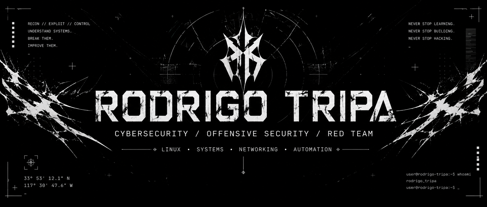

 

### CYBERSECURITY STUDENT · OFFENSIVE SECURITY · LINUX

`PENTESTING` · `RED TEAM` · `SECURITY TOOLING` · `SYSTEMS`

 

---

# About

I'm a cybersecurity student from Portugal focused on offensive security, penetration testing and Linux-based systems.

I build practical security tools, maintain technical documentation and experiment with systems through personal projects and a developing homelab.

My current path is centered around understanding how systems work, how they fail, and how they can be assessed from an offensive security perspective.

---

# Current Focus

| Area | Focus |
| --- | --- |
| Offensive Security | Penetration Testing · Red Team |
| Systems | Linux · System Administration |
| Development | Bash · Python · Security Tooling |
| Infrastructure | Homelab · Virtualization · Docker |
| Research | Cybersecurity · Networking · Digital Forensics |

---

# Currently Building

### NERO

An experimental AI project currently under active development.

> **Status:** Active Development · Subject to Change

### Homelab

A personal infrastructure project currently under development for experimentation, self-hosting and systems administration.

> **Status:** Under Development

---

# Selected Work

### Linux Security Audit Tool

A Bash-based Linux security auditing and hardening tool designed to automate security checks and identify potentially insecure system configurations.

**Current release:** `v1.0.0` · **Stable**

**Focus**

`Linux Security` · `Auditing` · `Hardening` · `Privilege Analysis`

**Capabilities**

- User and group auditing
- SUID / SGID enumeration
- SSH configuration analysis
- Firewall inspection
- Open port discovery
- Security configuration checks
- Persistence-related checks
- Security report generation
- SHA-256 report integrity

[View Repository](https://github.com/Rodrigo-Tripa/linux-security-audit-tool)

---

### MetaTrace Lite

A lightweight digital forensics tool for analysing and interpreting image metadata.

**Current release:** `v0.4.1` · **Stable**

**Focus**

`Digital Forensics` · `Metadata Analysis` · `OSINT` · `Image Analysis`

**Capabilities**

- EXIF extraction
- GPS coordinate analysis
- Device identification
- Software and editing detection
- Temporal metadata validation
- GPS accuracy assessment
- Structured JSON reporting

[View Repository](https://github.com/Rodrigo-Tripa/metatrace-lite)

---

### Cyber Notes

A public technical knowledge base documenting my cybersecurity learning and research.

The repository covers subjects across cybersecurity, networking, operating systems, programming, security tools, walkthroughs and technical references.

**Focus**

`Cybersecurity` · `Linux` · `Networking` · `Web Security` · `Windows` · `Active Directory` · `Cryptography`

[View Repository](https://github.com/Rodrigo-Tripa/Cyber-Notes)

---

### PentAssist

An experimental security-related project currently under development.

> **Status:** Experimental · Subject to Change

[View Repository](https://github.com/Rodrigo-Tripa/PentAssist)

---

### cracker1

An experimental project currently subject to change.

> **Status:** Experimental · Subject to Change

[View Repository](https://github.com/Rodrigo-Tripa/cracker1)

---

# Toolkit

### Operating Systems

### Languages

### Infrastructure & Development

---

# Learning

My current learning is driven primarily through hands-on practice, personal projects, technical documentation and TryHackMe.

Current areas of study include:

`Linux` · `Networking` · `Windows` · `Active Directory` · `Docker` · `Bash` · `Python` · `Offensive Security`

---

# GitHub

---

`RODRIGO TRIPA`

Cybersecurity · Offensive Security · Linux

 

*Building systems. Studying security.*

